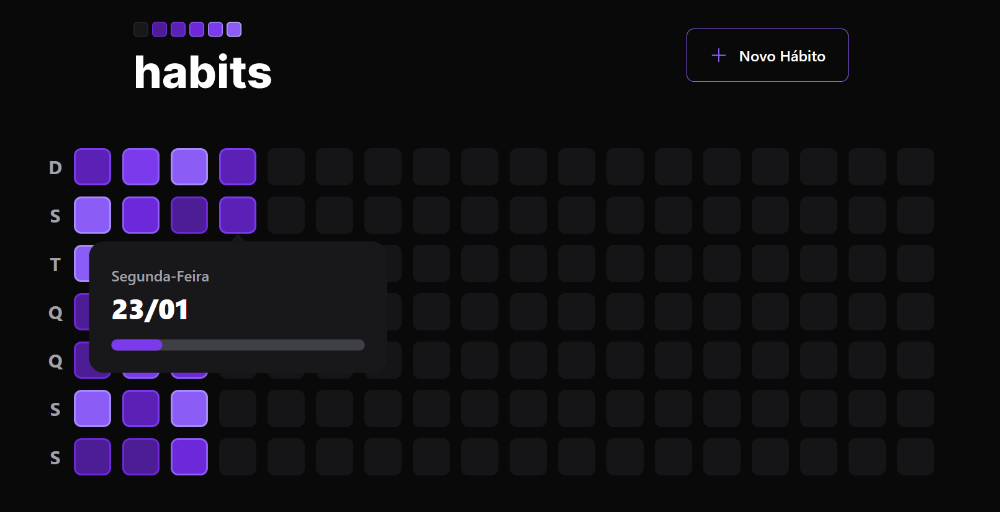

# NLW Setup - Trilha Ignite

## 💻 Projeto

Projeto sendo desenvolvido como resultado dos aprendizados obtidos no <strong>NLW Setup da Rocketseat</strong>. Estou desenvolvendo um <strong>App de Controle de Hábitos</strong> junto com os instrutores, evoluindo na programação ↗.

## Preview - WEB

  

## Preview - Mobile

> Está sendo desenvolvida ◾◾◾

### Estudos

- [x] Banco de dados utilizando a tecnologia <strong>Prisma</strong>
- [x] Desenvolvimento das APIS

## Tecnologias 🛠

- [TypeScript](https://www.typescriptlang.org/)
- [React](https://reactjs.org/)
- [React Native](https://reactnative.dev/)
- [Expo](https://expo.dev/)
- [Fastify](https://www.fastify.io/)
- [Prisma](https://www.prisma.io/)
- E muitas outras…

## 🔖 Layout

Você pode visualizar o layout do projeto através do link abaixo:

- [Layout](https://www.figma.com/file/7hzvJpZKKQtGdojjmWESdx/Habits-(i)-(Community)?node-id=6%3A343&t=3tNzqQmebZdu7qlG-0)

Lembrando que você precisa ter uma conta no [Figma](http://figma.com/).

