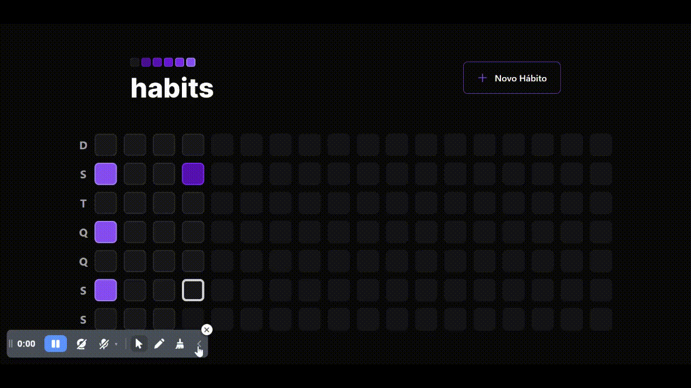

# NLW Setup 
>Trilha Ignite

  

  O Projeto foi desenvolvido como resultado dos aprendizados obtidos no <strong>NLW Setup da Rocketseat</strong>. Junto com os instrutores criamos um <strong>App de Controle de Hábitos</strong>, uma grande experiência que me fez evoluir ainda mais na programação.

  Utilizando as tecnologias do <strong>React</strong> e <strong>React Native</strong> para desenvolver a aplicação em Web e Mobile, além do desenvolvimento do Servidor do projeto com o Banco de Dados e a realização da conexão do <strong><em>Back-end</em></strong> com o <strong><em>Front-end</em></strong>.

## Preview - Mobile e WEB 🌎📱

> Aperte o <strong>play</strong> para visualizar o gif!

  
  

## Modelo ERD da aplicação 🏦🎲
> Banco de Dados - Relacional

## Estudo Geral 📖👨🏽‍💻

>Tópicos relevantes

- [x] Banco de dados utilizando a tecnologia <strong>Prisma</strong>
- [x] Desenvolvimento da Api
- [x] Construção do Layout da aplicação com React a parte Web e React-Native a parte Mobile
- [x] Criação do <strong>SQL Raw</strong> (SQL na mão), possibilitando deixar as <em>Querys</em> mais complexas (mais Condições e Relacionamentos)
- [x] Criação de PopOver e Modais, utilização da biblioteca <strong>Radix-UI</strong> (para fornecer acessibilidade ao usuário com alguma deficiência) - Web e Mobile
- [x] Conexão do Back-end com o Front-end, utilizando a biblioteca <strong>Axios</strong>
- [x] Utilização do <strong>Try</strong> and <strong>Catch</strong>, para tratar possíveis erros da melhor forma
- [x] Foi adicionado configurações de <strong>Transitions</strong> e <strong>Focus</strong> no projeto Web, deixando as ações em tela mais dinâmicas e interativas com animações
- [x] Foi utilizado a biblioteca <strong>Animated</strong> do React Native no projeto Mobile, deixando as ações em tela mais dinâmicas e interativas com animações 

## Tecnologias 🛠

- [TypeScript](https://www.typescriptlang.org/)
- [React](https://reactjs.org/)
- [React Native](https://reactnative.dev/)
- [Expo](https://expo.dev/)
- [Fastify](https://www.fastify.io/)
- [Prisma](https://www.prisma.io/)
- E muitas outras…

## 🔖 Layout

Você pode visualizar o layout do projeto através do link abaixo:

- [Layout](https://www.figma.com/file/7hzvJpZKKQtGdojjmWESdx/Habits-(i)-(Community)?node-id=6%3A343&t=3tNzqQmebZdu7qlG-0)

Lembrando que você precisa ter uma conta no [Figma](http://figma.com/).

## Bootcamp Rocketseat ⚡
- <a target="_blank" href="https://www.rocketseat.com.br/">Site Rocketseat</a>

## Aluno 👨🏽‍🎓

- <a target="_blank" href="https://www.linkedin.com/in/ramon-barreto-076191180/">Ramon Barreto</a>

## Contato 📲

- Email: ramon_barreto_medrado@hotmail.com

